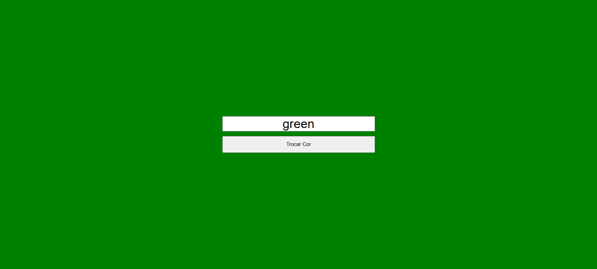

# Trocar Cor com JavaScript e CSS Variables

## Descrição

Este projeto é um exemplo simples de página dinâmica feita com HTML, CSS e JavaScript.
O usuário digita uma cor em um campo de texto e, ao clicar no botão, a cor de fundo da página é alterada dinamicamente utilizando variáveis CSS manipuladas via JavaScript.

## Tecnologias utilizadas

HTML5 → estrutura da página (input + botão).

CSS → uso de variáveis (--bg-color) para definir a cor do fundo.

JavaScript → captura o valor digitado e altera a variável CSS em tempo real.

## Estrutura dos arquivos

index.html → contém a interface (campo de texto e botão).

style.css → define o estilo da página e a variável --bg-color.

app.js → controla a lógica de interação (captura a cor digitada e altera o fundo).

Autor:
Aline Alves de Souza (www.linkedin.com/in/aline-alves-engenheira)
